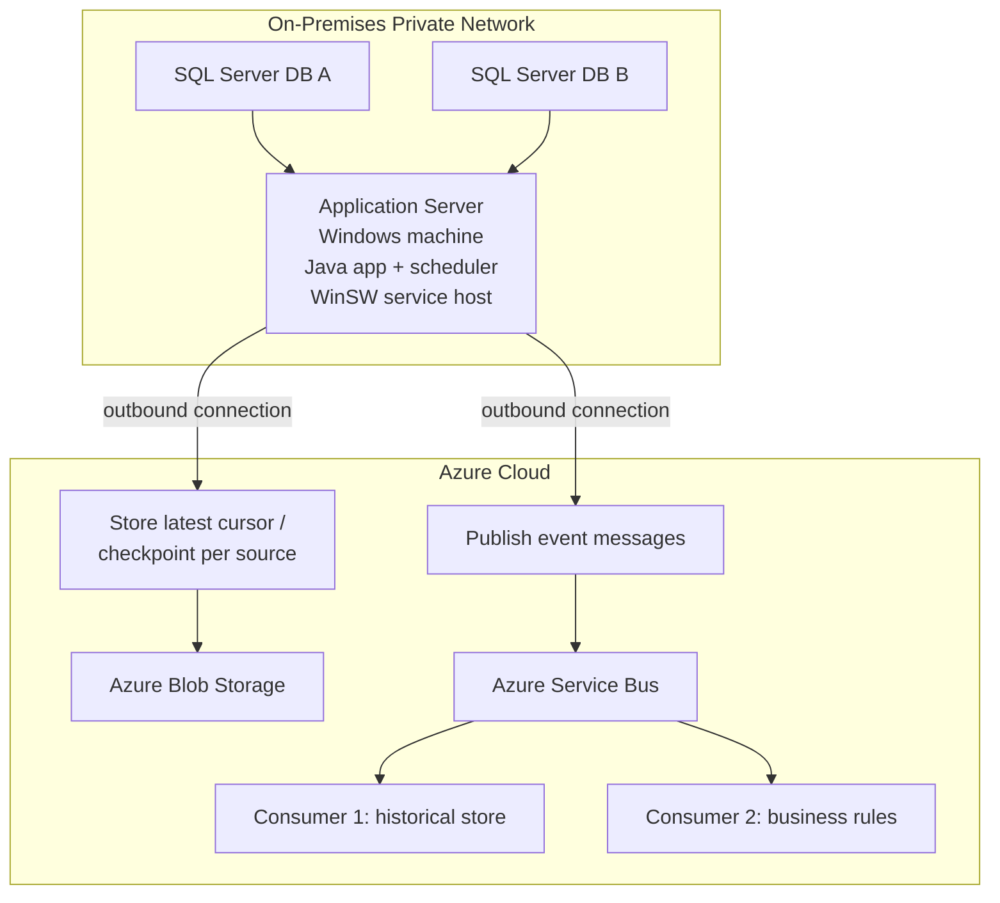

# Polling Legacy SQL Server From On-Premises to Azure With a Scheduled Java Service

## Why this matters
Some integration projects sit in the uncomfortable space between old infrastructure and newer cloud platforms.

That was exactly the shape of this project. The source data lived in SQL Server databases inside a private network behind firewalls. The integration logic had to run from an on-premises machine that could reach those databases. At the same time, the results needed to feed Azure components in the cloud for downstream processing.

This kind of setup is not unusual in enterprise environments. What makes it tricky is that the hard part is rarely just one thing. It is usually a combination of constraints:

- legacy SQL Server versions
- tables that were not modeled with clean primary keys
- firewall and network restrictions
- scheduled execution requirements
- the need to move data safely into cloud-native services

The solution that worked well here was a polling Java application running as a Windows Service on-premises, with Azure Blob Storage and Azure Service Bus acting as the bridge into the cloud.

## Context
The application was not a web app. It was a background Java process with its own scheduler, running every minute on an on-premises Windows machine.

That machine sat in the right network zone to reach the SQL Server databases that were otherwise inaccessible from the public internet. Those databases were inside a private environment protected by firewalls, so the safest and most realistic design was to keep the polling logic close to the source.

From there, the Java application had to do a few things reliably:

1. Connect to one or more SQL Server databases inside the private network.
2. Read only the new rows since the last successful run.
3. Persist the latest processed cursor outside the process.
4. Publish the extracted records into Azure for asynchronous downstream processing.

There was another important requirement in the real project: the application was not reading from one single legacy schema.

It had to support four different database schemas that represented similar business events in different ways. The output, however, needed to be standardized. No matter which source schema the application instance was connected to, the result had to be converted into the same message template before being published to Azure Service Bus.

That requirement pushed the design toward a single codebase with schema-specific behavior selected by configuration.

There were also a few legacy details that shaped the implementation.

First, some of the source tables did not have primary keys. That immediately made ORM-style assumptions less useful. For read-only extraction, Spring JDBC with `JdbcTemplate` and `RowMapper` was a much better fit because it let the application map rows explicitly without pretending the table had stable entity identity.

Second, one of the SQL Server environments was old enough that the JVM had to tolerate TLS 1.0 during the connection handshake. That is not something I would recommend as a long-term design, but in real projects these compatibility compromises sometimes keep the integration alive until the infrastructure can be modernized.

Change Data Capture was also not a good fit here. Between the legacy environment, operational restrictions, and the need for a controlled deployment on an existing machine, an application-managed polling model ended up being much more practical.

## Main ideas
The architecture had three clear zones:

- SQL Server databases inside the private on-premises network
- an on-premises application server hosting the scheduled Java service
- Azure services receiving and distributing the extracted events

Inside the application, there was also a fourth concern: schema adaptation.

The same deployed service could run against different customer or environment databases, but each instance needed to understand which legacy schema it was speaking to. Rather than cloning the project four times or filling the code with `if/else` branches, the application used the Strategy pattern.

The flow looked like this:



That diagram captures the main communication paths:

- The SQL Server databases never talk directly to Azure.
- The Java application server is the bridge between the private network and the cloud.
- Azure Blob Storage stores cursor or checkpoint state so progress survives restarts.
- Azure Service Bus decouples extraction from downstream consumers.

That separation was important. The polling service only needed to focus on reading data safely and publishing messages. The consumers could evolve independently without changing the extraction logic.

Inside the polling service, the same kind of separation helped keep the code maintainable:

- one common scheduling and publishing flow
- one common outbound message contract
- one schema strategy per legacy database shape

Each strategy knew how to:

- query its specific schema
- map rows from that schema
- convert the result into the common message template
- provide the right cursor logic for incremental reads

At the application level, the routine behaved roughly like this:

1. Load the last processed cursor for a given source.
2. Query SQL Server for rows newer than that cursor.
3. Map each row into a schema-specific internal object.
4. Convert that object into a common message template.
5. Publish each message to Azure Service Bus.
6. Save the new cursor after successful processing decisions.

For a source table without a primary key, that did not mean the integration was impossible. It only meant the code had to be honest about what the table was: a read-only source, not a well-behaved aggregate.

Spring JDBC worked well for that:

```java
@Repository
public class LegacyEventRepository {

    private final JdbcTemplate jdbcTemplate;

    public LegacyEventRepository(JdbcTemplate jdbcTemplate) {
        this.jdbcTemplate = jdbcTemplate;
    }

    public List<LegacyEvent> findNewRows(String lastCursor) {
        String sql = """
            SELECT event_code, description, changed_at
            FROM legacy_event_table
            WHERE changed_at > ?
            ORDER BY changed_at ASC
            """;

        return jdbcTemplate.query(sql, legacyEventRowMapper(), lastCursor);
    }

    private RowMapper<LegacyEvent> legacyEventRowMapper() {
        return (rs, rowNum) -> new LegacyEvent(
            rs.getString("event_code"),
            rs.getString("description"),
            rs.getTimestamp("changed_at").toLocalDateTime()
        );
    }
}
```

The key point is that `RowMapper` does not need a primary key to do its job. It simply maps each row from the `ResultSet` into a Java object.

Where the design became more interesting was the normalization step after the read.

Conceptually, it looked something like this:

```java
public interface LegacySchemaStrategy {
    List<CommonEventMessage> findNewMessages(String lastCursor);
    String sourceName();
}
```

Each implementation handled one legacy schema:

```java
@Component
public class SchemaAStrategy implements LegacySchemaStrategy {

    private final SchemaARepository repository;

    public SchemaAStrategy(SchemaARepository repository) {
        this.repository = repository;
    }

    @Override
    public List<CommonEventMessage> findNewMessages(String lastCursor) {
        return repository.findNewRows(lastCursor).stream()
            .map(this::toCommonMessage)
            .toList();
    }

    @Override
    public String sourceName() {
        return "schema-a";
    }

    private CommonEventMessage toCommonMessage(SchemaARow row) {
        return new CommonEventMessage(
            row.eventCode(),
            row.description(),
            row.changedAt(),
            "schema-a"
        );
    }
}
```

Then a configuration parameter in `application.yaml` selected which strategy the application instance should use:

```yaml
legacy:
  source-schema: schema-a
```

With that in place, the instance could be deployed with the same artifact but different configuration depending on the target database. One environment might run with `schema-a`, another with `schema-b`, and so on, while the rest of the scheduling, cursor handling, Azure publishing, and Windows service setup stayed unchanged.

That approach gave the project two important benefits:

- one codebase instead of four near-duplicate applications
- one stable message format for downstream Azure consumers

The consumers in the cloud did not need to care about the original database schema. That concern stayed isolated inside the on-premises polling service, which is exactly where it belonged.

The scheduled routine itself could stay simple:

```java
@Scheduled(fixedRate = 60000)
public void sync() {
    String cursor = cursorStore.get("database-a");
    List<LegacyEvent> newRows = repository.findNewRows(cursor);

    for (LegacyEvent row : newRows) {
        publisher.publish(row);
        cursor = row.changedAt().toString();
    }

    if (!newRows.isEmpty()) {
        cursorStore.save("database-a", cursor);
    }
}
```

This is where Azure Blob Storage helped. By storing the latest cursor outside the process, the service could restart without losing track of where it left off.

## Running it on Windows
Because the job needed to run continuously on an on-premises Windows server, packaging the Java process as a Windows Service made operations much easier.

Instead of depending on a logged-in user or a scheduled task with ad hoc startup behavior, the application could run as a proper service managed by the operating system. [WinSW](https://github.com/winsw/winsw) was a practical way to do that because it wraps the Java command and manages installation, startup, and logging.

A simple layout looked like this:

```text
C:\services\legacy-sync\
  legacy-sync.exe
  legacy-sync.xml
  legacy-sync.jar
  logs\
```

And the WinSW configuration could be as small as this:

```xml
<service>
  <id>legacy-sync</id>
  <name>Legacy Sync</name>
  <description>Runs the scheduled Java integration service.</description>

  <env name="APP_ENV" value="production" />
  <env name="JAVA_OPTS" value="-Xms256m -Xmx512m" />

  <executable>java</executable>
  <arguments>%JAVA_OPTS% -jar "%BASE%\\legacy-sync.jar"</arguments>

  <log mode="roll" />
</service>
```

Then installation was straightforward from an elevated terminal:

```powershell
cd C:\services\legacy-sync

.\legacy-sync.exe install
.\legacy-sync.exe start
.\legacy-sync.exe status
```

WinSW did not solve the integration logic itself, but it solved the operational problem of keeping the Java process alive in a Windows environment.

## Things to watch out for
This design worked well, but there were a few tradeoffs worth respecting.

- Polling requires careful idempotency because failures can happen after publishing but before saving the cursor.
- Tables without primary keys may contain duplicates, so the extraction logic has to tolerate ambiguity.
- Ordering must be explicit. Without `ORDER BY`, incremental reads become dangerous.
- Legacy SQL Server versions can force temporary compatibility measures such as allowing TLS 1.0 on the JVM side.
- Supporting multiple schemas in one codebase only works well if the shared contract is truly stable and each strategy owns its schema-specific quirks cleanly.
- The Windows service account must have the right permissions for logs, local files, network access, and outbound communication to Azure.
- Cursor design matters. If the chosen cursor is not stable or unique enough, retries and restarts become messy.

The biggest lesson is that reliability comes from the whole design, not from one library. `RowMapper`, Blob Storage, Service Bus, and WinSW each solved a specific problem, but the integration only felt robust once all those pieces were working together.

## Closing thoughts
What I like about this architecture is that it respects the reality of the environment instead of fighting it.

The SQL Server databases stayed inside the private network. The polling logic ran on the machine that could legally and technically reach them. Azure components handled the cloud-facing parts of the workflow without requiring the databases themselves to be exposed.

The part I liked most was that the system stayed adaptable without becoming fragmented. Four different legacy schemas could be supported by one application, with configuration selecting the correct strategy and all outputs normalized into the same message contract.

It was not the most fashionable architecture, but it was pragmatic and reliable. For legacy integration work, that combination usually matters more than elegance.
